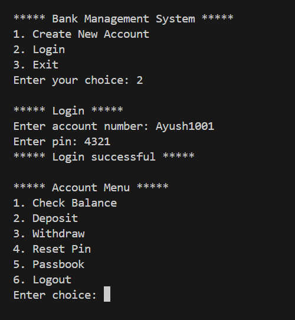
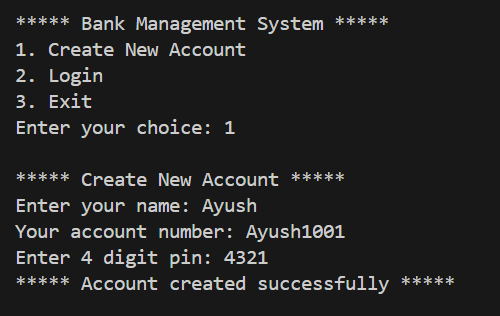
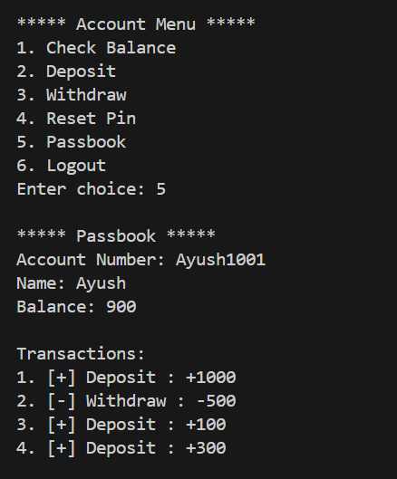

# 💳 Bank Management System

A simple and efficient **Command-Line Bank Management System** built using **Python**.

This project demonstrates:
- Object-Oriented Programming (OOP)
- File Handling
- JSON-based Data Storage
- Menu-driven CLI application

---

## 🚀 Features

- 🆕 Create a new bank account  
- 🔐 Secure login using account number and PIN  
- 💰 Deposit money  
- 💸 Withdraw money  
- 📊 Check account balance  
- 🔁 Reset account PIN  
- 📘 View passbook (transaction history)  
- 💾 Data stored persistently using JSON  

---

## 🛠️ Tech Stack

- **Python** (Core Language)
- **JSON** (File Storage)
- **OOP** (Object-Oriented Programming)

---

## 📁 Project Structure

```
bank-management-system/
│
├── main.py              # Main program logic
├── account.json         # Stores account data (auto-generated)
├── README.md            # Project documentation
│
└── screenshots/         # Output images
    ├── login.png
    ├── create.png
    └── passbook.png
```

---

## ⚙️ How to Run

### Prerequisites
- Python 3.6 or higher installed on your system

### Steps

1. **Clone the repository**
   ```bash
   git clone https://github.com/devwithayush/bank-management-system.git
   ```

2. **Navigate to the project folder**
   ```bash
   cd bank-management-system
   ```

3. **Run the program**
   ```bash
   python main.py
   ```

---

## 📸 Screenshots

### 🔐 Login System


### 🆕 Account Creation


### 📘 Passbook & Transactions


---

## 💡 How It Works

1. **Account Creation**: Users create an account with a name, auto-generated account number, and a 4-digit PIN
2. **Login**: Secure login using account number and PIN
3. **Transactions**: Deposit, withdraw, and check balance
4. **History**: View complete transaction history (passbook)
5. **PIN Management**: Reset PIN for security
6. **Data Persistence**: All data is saved in JSON format

---

## 🔮 Future Improvements

- 🔁 Money transfer between accounts  
- ❌ Account deletion feature  
- 🕒 Transaction timestamps  
- 🗄️ Database integration (SQLite/MySQL)  
- 🔐 Enhanced security features  
- 📊 Account statistics and analytics  

---

## 📝 License

This project is open source and available under the MIT License.

---

## 👨‍💻 Author

**Ayush Kumar Sharma**

Feel free to connect on GitHub or reach out for feedback!
